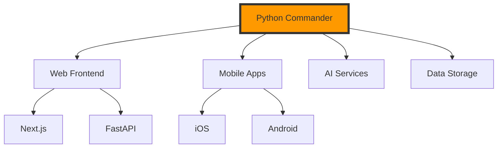

# Personal AI-Era Component Library / meta-blocks

## 1. Core Philosophy
In the AI programming era, instead of relying on massive frameworks, meta-blocks encourages building your own small, focused components that you can easily reuse and combine. Think of each component as a "word" in your personal programming language.

### Key Ideas
- Build small, focused components
- Keep each component simple and reusable
- Combine them easily for new apps
- Let AI help with the integration 

## 2. Component Examples
```python
# AI Chat Component
chat = ai_chat(
model="gemini",
style="floating"
)
# Data Component
data = data_handler(
source="csv",
auto_clean=True
)
# Quick UI
ui = quick_ui(
layout="dashboard",
theme="dark"
)
```

## 3. Building Apps

### Simple Way
```python
app = (
chat
.with_data(data)
.with_ui(ui)
.build()
)
```

## 4. Key Benefits

1. Build Fast
   - Reuse tested components
   - Quick prototyping
   - Easy modifications

2. Stay Flexible
   - Mix any technologies
   - Change parts easily
   - Add new features

3. Keep Control
   - Understand each piece
   - No black boxes
   - Easy to debug

Other specific benefits including:
  
4. **AI-Friendly Structure**
   - Clear method names
   - Consistent patterns
   - Strong type hints
   - Comprehensive docstrings

5. **Developer Experience**
   - Chainable methods
   - Self-documenting code
   - Built-in logging
   - Easy debugging

6. **Maintainability**
   - Modular components
   - Clear dependencies
   - Consistent structure
   - Easy to test

## 5. Development Style

1. When you need something:
   - Build a small component
   - Test it works
   - Save for reuse

2. When building new apps:
   - Pick needed components
   - Combine them
   - Customize if needed

## 6. Future Growth

Add components when:
1. You solve a new problem
2. You find a better way
3. You need new features

Remember: Keep it simple, practical, and focused on your needs!

This approach embraces the AI era by:
1. Building exactly what you need
Keeping components simple
Making reuse easy
4. Letting AI help with integration
Staying flexible for future changes


## 7. Real World Example

Building an AI chat app
```python
app = (
ChatApp()
.with_model("gemini") # Set AI model
.with_database("mongo") # Add database
.with_ui("floating") # Set UI style
.with_auth("google") # Add authentication
.build() # Create the app
)

web = WebComponent()
    .init_app(templates_dir, static_dir)    # Initialize application
    .with_debug(True)                       # Set debug mode
    .with_host('127.0.0.1')                 # Set host
    .with_port(8000)                        # Set port
    .with_chat_window()                     # Add chat window
    .with_stream(stream)                    # Add stream processing
    .run()                                  # Run server
```

## 8. Innovation
- True technology independence: Not bound to specific tech stack
- Extreme pluggability: Components can be combined freely
- Unified interface: All components follow the same pattern
- Zero configuration: Ready to use out of the box
- Auto adaptation: Components auto-coordinate with each other

```python
   # Dynamic component discovery and loading
   app.discover_components()     # Auto discover available components
   app.hot_swap(old, new)       # Runtime component replacement

   # Intelligent component configuration
   app.auto_optimize()          # Auto optimize configuration
   app.self_heal()             # Self-healing capability

   # Cross-language support
   app.with_rust_component()    # Integrate Rust components
   app.with_go_service()        # Integrate Go services
```
## Unique advantages
### Simplified Complexity
- Users don't need to understand underlying implementation
- No need to manage multiple services
- No need to handle inter-process communication
### Standardized Integration
- All components follow unified interfaces
- Automatic component communication
- Unified configuration and management
### Development Experience
- One entry point controls everything
- Clear component lifecycle
- Simple error handling
### Extensibility
- Easy to add new components
- Flexible technology stack switching
- Maintain consistent interfaces
  
These features make the design particularly powerful because it provides a unified, simple, and extensible way to manage complex systems while hiding the underlying complexity from the users.




```python
# Meta-blocks Innovative Design
class Application:
    def __init__(self):
        self.components = {}
    
    def with_component(self, name: str, component: Any):
        """Any technology stack component can be integrated"""
        self.components[name] = component
        return self
        
    def run(self):
        """Unified management of all components"""
        for component in self.components.values():
            component.start()
```
This code shows the core design of meta-blocks where:
- Components can be from any technology stack
- All components are managed in a unified way through Python
- The Application class acts as the central orchestrator
- The design emphasizes simplicity and flexibility while maintaining unified control over diverse technology components.

